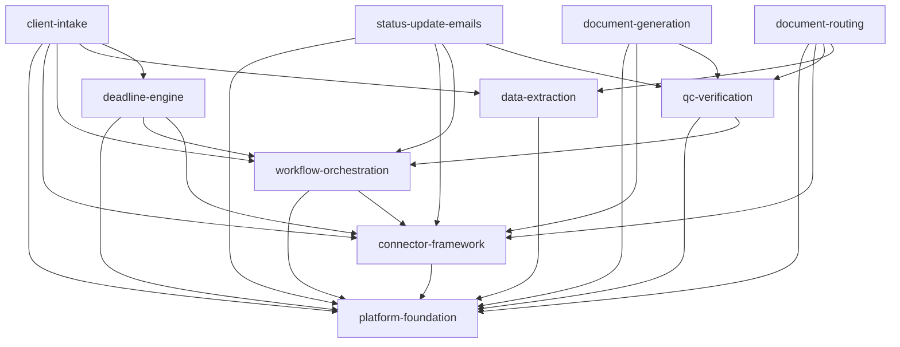

# Case Automation MCP Server — Technical Specifications

Implementation-ready specifications for the Case Automation MCP Server, built on
the conceptual `concept/PRD.md` (product requirements) and `concept/PTD.md`
(technical design). These specs elaborate the concept into a form that can be
built with no open assumptions — every unconfirmed decision is explicitly
flagged `ASSUMPTION (confirm)`.

**Client:** US-based immigration law firm.
**Baseline stack:** as specified in `concept/PTD.md` §3 (Python / FastMCP / FastAPI / Pydantic v2 / PostgreSQL / Redis / …).
**Existing systems (case mgmt, CRM, email, doc store):** vendor-agnostic — ports specified, adapters deferred until vendors confirmed.

> **Read first:** `_shared/CONVENTIONS.md` — the shared spec process, domain
> model, risk tiers, compliance baseline, glossary, and file templates that
> every feature spec below inherits.

> **Canonical DAG:** `../manifest.yml` (at the project root) is the
> machine-readable source of truth for the project — every spec, its `type`
> (`unit` / `integration`), status, dependencies, and declared
> `produces`/`consumes` interface contracts. It is validated against the DAG
> invariants in `concept/PROJECT_MANIFEST.md §C`. When the manifest and this
> README disagree on structure, **the manifest wins**; this README is the
> human-facing narrative index.

---

## How these specs are organised

Each feature is a self-contained package with the full four-phase artifact set:

```
<feature>/
├── planning/requirements.md   # Phase 1 — what & why
├── spec.md                    # Phase 2 — behavioural contract
├── tasks.md                   # Phase 3 — dependency-mapped tasks
├── pbt-properties.md          # Phase 4 — property-based tests
└── security-audit-prep.md     # Phase 4 — security review checklist
```

The four-phase, gated process (de-jargoned) is described in
`_shared/CONVENTIONS.md §1`.

---

## Feature specs

Grouped to match the three milestones in `../manifest.yml`. `Type` is the
manifest classification: **unit** = a distinct component; **integration** = a
non-trivial composition of ≥2 units (a runtime workflow that wires other specs
together).

### Milestone `foundations` — built first

| Spec | Type | Purpose |
|---|---|---|
| [`platform-foundation`](./platform-foundation/) | unit | Domain model, persistence, hash-chained audit log, config & secrets, observability, security baseline, docs/CI discipline. |
| [`connector-framework`](./connector-framework/) | unit | Vendor-agnostic ports & adapters, webhook ingestion, retries/idempotency, `ConnectorError` taxonomy, contract-test harness. |
| [`workflow-orchestration`](./workflow-orchestration/) | unit | Durable, resumable state-machine engine; gates; idempotency; retry/compensation; triggers. |

### Milestone `core-services` — engines consumed by workflows

| Spec | Type | Purpose |
|---|---|---|
| [`data-extraction`](./data-extraction/) | unit | Text + OCR + provider-agnostic LLM structuring with per-field confidence. |
| [`qc-verification`](./qc-verification/) | unit | Composable verification check registry (completeness, consistency, recipient/attachment integrity, privilege, deadline sanity, extraction confidence) feeding gates. |
| [`deadline-engine`](./deadline-engine/) | unit | Declarative rule sets, business-day calc, reminders, escalation, reconciliation. **Liability-critical.** |

### Milestone `workflows` — client-facing automations

| Spec | Type | Purpose |
|---|---|---|
| [`client-intake`](./client-intake/) | integration | Lead → CRM contact + matter shell + opening tasks + draft welcome (gated send). |
| [`status-update-emails`](./status-update-emails/) | integration | Status change → drafted update → recipient-integrity QC → approval gate → send/log. |
| [`document-generation`](./document-generation/) | unit | Template → DOCX/PDF, versioned, gaps surfaced, QC, store. |
| [`document-routing`](./document-routing/) | integration | Classify, name, file, permission documents; privilege-aware. |

---

## Cross-feature dependency graph



*Integration specs (per `../manifest.yml`): `client-intake`, `status-update-emails`, `document-routing`. Every edge above corresponds to a declared `produces`/`consumes` interface contract in the manifest.*

---

## Build sequence (maps to PRD §12 / PTD §17)

The table below maps specs to the PRD's product waves. **Execution order is
governed by the DAG in `../manifest.yml`, not by the wave label** — a spec may
only start once all of its `depends_on` specs are `approved` (manifest invariant
5). The manifest groups specs into build-layer milestones
(`foundations → core-services → workflows`) that reflect this ordering.

| Phase | Build | Specs |
|---|---|---|
| **0 — Foundations** | Domain model, MCP scaffold, Postgres + audit, secret store, one read-only connector per category, docs/CI framework. | `platform-foundation`, `connector-framework` (read paths), `workflow-orchestration` (engine core) |
| **1 — Wave 1** | Orchestrator + gates, deadline engine, intake, status-update drafts. | `deadline-engine`, `client-intake`, `status-update-emails` (+ QC slice — see note) |
| **2 — Wave 2** | Write-path connectors, doc generation, routing, extraction. | `data-extraction`, `document-generation`, `document-routing` |
| **3 — Wave 3** | Full QC suite, reconciliation, connector onboarding, hardening, compliance path. | `qc-verification` (full suite), reconciliation (within `deadline-engine`) |

> **⚠️ QC pull-forward (DAG vs. wave label).** The PRD schedules the *full* QC
> suite in Wave 3, but the Wave-1 `status-update-emails` workflow `consumes`
> `qc_verify` (its recipient-integrity check) and `document-generation` /
> `document-routing` (Wave 2) gate on QC too. Per the DAG, a spec cannot be
> approved until its dependencies are. **`qc-verification` therefore sits in the
> `core-services` milestone and must be built before the workflows that gate on
> it** — landing at least the recipient-integrity check in Wave 1, with the
> remaining checks filled in through Wave 3. The wave numbers describe *product
> delivery*; the manifest DAG describes *build order*, and the DAG wins.

---

## Outstanding client confirmations (roll-up of `ASSUMPTION (confirm)` items)

These block nothing in the foundation specs but must be confirmed before the
relevant workflow is implemented:

1. **Vendors** for case management, CRM, email, and document store (drives which
   adapters to build first).
2. **Priority immigration case types & forms** to encode first (drives
   `client-intake`, `document-generation`, `deadline-engine` rule data).
3. **Deadline rule sets / jurisdictional specifics** to encode first (US federal
   immigration confirmed; specific rules unconfirmed).
4. **LLM provider** and where inference runs (privacy/residency).
5. **Risk-tier policy:** which actions are auto-allowed vs always gated.
6. **Hosting specifics** within firm-infra-or-cloud (residency region).
