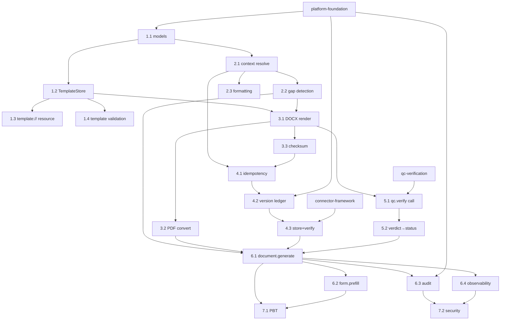

# Tasks — Document Generation

> Feature slug: `document-generation` · Wave 2 · Phase 3. Sizes per CONVENTIONS
> §10 (`XS/S/M/L`). Dependencies: intra-spec by task id; cross-spec as
> `<slug>#<id>`. Cross-spec deps reference `platform-foundation` (PF),
> `connector-framework` (CF), `qc-verification` (QC) — ids are illustrative
> placeholders (`ASSUMPTION (confirm)` once those specs' task ids are fixed).

---

## Overview (task groups + critical path + parallelisation)

**Groups:**

1. **Template model & store** — `TemplateSpec`/`TemplateVariable`, declared
   variables, `template://` resource, template validation.
2. **Context resolution & gap detection** — build context from domain data;
   surface gaps; deterministic formatting.
3. **Render pipeline** — DOCX render + PDF convert; deterministic; gap
   placeholders.
4. **Versioning, checksum & store** — monotonic version ledger, checksum,
   idempotency, `DocStoreConnector.put`.
5. **QC integration** — call `qc.verify`; map verdict to status.
6. **MCP tools** — `document.generate`, `form.prefill`; audit; observability.
7. **Validation hardening** — PBT + security wiring (handoff to Phase 4 files).

**Critical path:** G1 → G2 → G3 → G4 → G6. G5 (QC) integrates after G3 and
before final status in G6. G2 and G3's formatting work can proceed in parallel
once G1's `TemplateSpec` shape is fixed.

**Parallelisable:** template validation (1.4), formatting rules (2.3), metrics
wiring (6.4) can run alongside their siblings.

---

## Group 1: Template model & store

- [ ] **1.1 Define `TemplateSpec` / `TemplateVariable` / `Gap` / `GenerationResult`**
  — size **S** · depends on: `platform-foundation#domain-model` · parallel: no.
  - Acceptance: Pydantic v2 models match spec §3; required vs optional explicit;
    types include `date/enum`; serialise to JSON schema for tool/resource.
  - Tests: model round-trip; required-default is `true`; enum requires
    `enum_values`; rejects unknown `type`.
- [ ] **1.2 `TemplateStore.get(name[,version])`** — size **S** · depends on: 1.1,
  `platform-foundation#config` · parallel: no.
  - Acceptance: loads `TemplateSpec` + bytes by name; pins/returns
    `template_version`; `TemplateNotFound` on unknown; templates loaded as data
    (no code execution) per CONVENTIONS §5/§8.
  - Tests: known name returns spec+bytes; unknown → `TemplateNotFound`; version
    pin returns requested version.
- [ ] **1.3 `template://{name}` MCP resource** — size **XS** · depends on: 1.1,
  1.2 · parallel: yes.
  - Acceptance: returns declared required+optional variables, format,
    `target_form_id`, version, checksum; self-describing (FR-17).
  - Tests: resource lists all declared vars; absent template → typed error.
- [ ] **1.4 Template validation (reject non-deterministic templates)** — size
  **S** · depends on: 1.2 · parallel: yes.
  - Acceptance: a template referencing `now()`/random/unbound side effects is
    rejected at load with a clear reason (protects DG-NFR-1); declared vars must
    match the template's actual Jinja2 variables.
  - Tests: template with `now()` rejected; declared/actual variable mismatch
    flagged; clean template passes.

## Group 2: Context resolution & gap detection

- [ ] **2.1 Build resolved context from `Matter`/`Contact` + overrides** — size
  **M** · depends on: 1.1, `platform-foundation#domain-model` · parallel: no.
  - Acceptance: maps domain fields → template variable paths; explicit
    `data_context` overrides domain-derived values; unknown override keys ignored
    (logged, no PII).
  - Tests: domain-only context; override precedence; unknown key ignored;
    missing source field leaves variable unresolved (not blank).
- [ ] **2.2 Gap detection** — size **M** · depends on: 2.1 · parallel: no.
  - Acceptance: each unresolved/empty/type-mismatched/enum-violating **required**
    variable becomes a `Gap` (name+label+reason); optional vars never gap; no
    silent coercion (FR-9).
  - Tests: missing required → gap; empty string → gap(`empty`); wrong type →
    gap(`type_mismatch`); bad enum → gap(`enum_violation`); optional missing →
    no gap.
- [ ] **2.3 Deterministic formatting (dates/names/numbers/locale)** — size **S**
  · depends on: 2.1 · parallel: yes.
  - Acceptance: configurable, deterministic formatters (US date, name ordering)
    so identical inputs format identically (supports determinism PBT).
  - Tests: date formats deterministically; same input twice → identical strings;
    locale config respected.

## Group 3: Render pipeline

- [ ] **3.1 DOCX render (docxtpl/python-docx + Jinja2)** — size **M** · depends
  on: 1.2, 2.2 · parallel: no.
  - Acceptance: renders DOCX from template + context; unresolved required vars
    rendered as a visible gap placeholder token, never empty (FR-9);
    deterministic for identical inputs.
  - Tests: full context renders all vars; missing var → placeholder present, no
    empty slot; identical inputs → identical bytes.
- [ ] **3.2 PDF convert (WeasyPrint | LibreOffice headless)** — size **M** ·
  depends on: 3.1 · parallel: no.
  - Acceptance: DOCX/HTML → PDF via configurable engine; convert failure handled
    per spec §6 (DOCX-only + warn, or `failed` if PDF mandatory — `ASSUMPTION
    (confirm)`); deterministic output for identical input.
  - Tests: DOCX→PDF succeeds; convert failure path; engine selectable by config.
- [ ] **3.3 Checksum of rendered artefact** — size **XS** · depends on: 3.1 ·
  parallel: yes.
  - Acceptance: stable checksum over primary artefact bytes; identical bytes →
    identical checksum.
  - Tests: checksum stable across runs; differs when bytes differ.

## Group 4: Versioning, checksum & store

- [ ] **4.1 Idempotency key + lookup** — size **S** · depends on: 2.1, 3.3 ·
  parallel: no.
  - Acceptance: key = supplied or `hash(template_name+version+canonical(context))`;
    existing key returns existing `Document` with no new version; collision with
    differing content refuses overwrite + errors (NFR-3).
  - Tests: same inputs → idempotent hit (no new version); differing-content
    collision → refused; explicit key honoured.
- [ ] **4.2 Monotonic version ledger (atomic allocation)** — size **M** ·
  depends on: 4.1, `platform-foundation#persistence` · parallel: no.
  - Acceptance: `version` monotonic per `(matter_id, template_name, doc_key)`;
    unique constraint prevents overwrite; concurrent runs never share a version
    (DB sequence/row lock); old versions immutable (DG-FR-8, NFR-3).
  - Tests: first version = 1; next = prev+1; concurrent allocation yields
    distinct versions; overwrite attempt rejected.
- [ ] **4.3 Store via `DocStoreConnector.put` + read-back verify** — size **M** ·
  depends on: 4.2, `connector-framework#docstore-port` · parallel: no.
  - Acceptance: stores bytes+metadata, returns `Document(version,checksum,uri)`;
    read-back bytes == rendered bytes; transient/rate-limit `ConnectorError`
    retried under same idempotency key; auth/fatal → `failed`+park+audit; never
    double-store.
  - Tests: round-trip bytes equality; transient error retried once; fatal →
    `failed`; no duplicate version on retry.

## Group 5: QC integration

- [ ] **5.1 Call `qc.verify` (completeness + consistency)** — size **S** ·
  depends on: 3.1, `qc-verification#verify-api` · parallel: no.
  - Acceptance: passes rendered artefact + declared/resolved variables; captures
    per-check verdict; completeness checks all-required-resolved; consistency
    checks names/dates (FR-13).
  - Tests: all resolved → completeness `pass`; injected inconsistency →
    consistency `fail`; verdict captured.
- [ ] **5.2 Map QC verdict → `GenerationResult.status`** — size **S** · depends
  on: 5.1 · parallel: no.
  - Acceptance: `pass`/`warn` + no gaps → `ready`; any `fail` → `blocked`; QC
    unavailable → `skipped`+`warn`, not `ready` (`ASSUMPTION (confirm)`
    block-vs-warn); gaps present → `incomplete` regardless of QC.
  - Tests: each verdict→status mapping; QC-down path; gaps force `incomplete`.

## Group 6: MCP tools

- [ ] **6.1 `document.generate` tool (orchestration)** — size **M** · depends
  on: 2.2, 3.2, 4.3, 5.2 · parallel: no.
  - Acceptance: runs the §5 flow; returns `GenerationResult`; risk tier
    `write (confirm)`; no send/file side effect (NFR-4); self-describing schema
    (FR-17).
  - Tests: happy path → `ready`+stored; gap → `incomplete`; QC fail → `blocked`;
    fatal store error → `failed`.
- [ ] **6.2 `form.prefill` tool** — size **M** · depends on: 6.1 · parallel: no.
  - Acceptance: `emit="fields_only"` returns `{resolved_fields, gaps, form_id,
    template_version}` and never fabricates; `emit="document"` delegates to
    `document.generate`; `form_id` from configured set (`ASSUMPTION (confirm)`
    I-130/I-485/N-400/G-28) (FR-9).
  - Tests: fields+gaps returned; no fabricated value; unknown `form_id` → error;
    `emit="document"` produces a `GenerationResult`.
- [ ] **6.3 Audit record per generation** — size **S** · depends on: 6.1,
  `platform-foundation#audit-log` · parallel: no.
  - Acceptance: exactly one hash-chained record per generation (actor, template
    name+version, input **digest** not raw PII, output checksum/version, gaps,
    QC verdict, idempotency key, run_id) written before "complete" (NFR-2).
  - Tests: record written on success and on `failed`; stores digest not raw PII;
    chain links to prior entry.
- [ ] **6.4 Observability wiring (logs/metrics/traces)** — size **S** · depends
  on: 6.1 · parallel: yes.
  - Acceptance: metrics + spans per spec §9; logs PII-scrubbed (no resolved
    values/bytes); `run_id` correlation (NFR-7).
  - Tests: metrics emitted per status; log scrubber drops PII fields; spans cover
    render/convert/qc/store.

## Group 7: Validation hardening

- [ ] **7.1 Property-based tests** — size **M** · depends on: 6.1, 6.2 ·
  parallel: no.
  - Acceptance: all invariants in `pbt-properties.md` implemented in Hypothesis
    (no silent blank; monotonic non-overwriting version; checksum integrity;
    determinism; all-resolved ⇒ completeness pass; idempotency).
  - Tests: the six property suites pass; seeded edge inputs included.
- [ ] **7.2 Security review wiring** — size **S** · depends on: 6.3, 6.4 ·
  parallel: yes.
  - Acceptance: surfaces in `security-audit-prep.md` covered — privilege default
    on outputs, PII never logged, residency-respecting store, RBAC on matter
    access, audit completeness.
  - Tests: privileged flag set per template; PII-in-log assertion; unauthorised
    matter access denied.

---

## Dependency graph (intra-spec + cross-spec)

**Cross-spec dependencies:** `platform-foundation` (domain model, persistence,
audit, config); `connector-framework#docstore-port`; `qc-verification#verify-api`.

---

## Definition of done (code + tests + docs)

A task/group is **done** only when all three are present (CONVENTIONS §1, PTD §16):

- **Code** — implemented against the domain model and ports (no vendor payloads
  in core); components under ~400 LoC or split as noted (spec §4).
- **Tests** — the group's focused tests pass; relevant PBT properties
  (`pbt-properties.md`) pass; DocStore round-trip contract test passes.
- **Docs** — `docs/workflows/document-generation.md` updated (trigger, tools,
  gaps behaviour, versioning/idempotency, QC interaction, failure handling);
  tool schemas self-describe and pass the docs CI check (FR-18); every
  `ASSUMPTION (confirm)` either resolved or still flagged.
