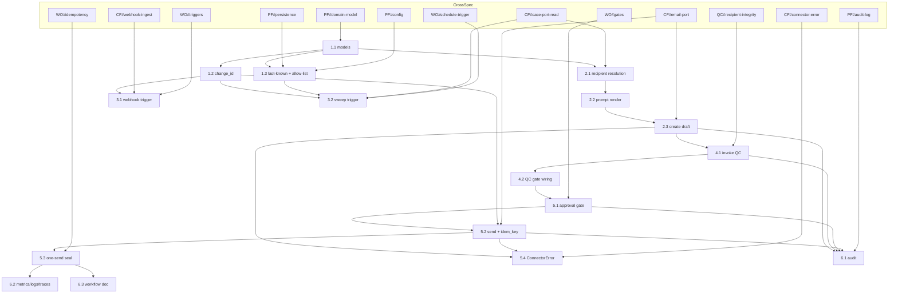

# Tasks — Status Update Emails

> Feature slug: `status-update-emails` · Wave 1 · Traces: FR-10, FR-6; NFR-2, NFR-4.
> Sizes: `XS`/`S`/`M`/`L` (CONVENTIONS §3.3, §10). Dependency notation: `depends on:
> <task-id>` (intra-spec) or `<slug>#<task-id>` (cross-spec). `parallel: yes` =
> shares no dependency with siblings. Cross-spec deps reference
> `platform-foundation` (PF), `connector-framework` (CF), `workflow-orchestration`
> (WO), `qc-verification` (QC) by their eventual task ids; here referenced by
> capability since sibling task ids are not yet assigned.

## Overview (task groups + critical path + parallelisation)

Six groups. **Critical path:** G1 (delta + change_id) → G2 (draft via Email port)
→ G4 (QC gate input) → G5 (gate + send + idempotency seal) → G6 (audit/observe).
G3 (triggers) can proceed in parallel with G2 once G1 lands. G6 instrumentation is
woven through but verified last.

- **G1 Delta & idempotency anchor** — pure/read; foundation for everything.
- **G2 Draft via Email port** — consumes prompt + port.
- **G3 Triggers (webhook + sweep)** — both converge on one run.
- **G4 QC recipient-integrity gate input** — consumes `qc-verification`.
- **G5 Approval gate, send & one-send guarantee** — the irreversible step.
- **G6 Audit, observability & docs** — NFR-2/NFR-7 + docs-as-done.

Cross-spec prerequisites (must exist first): PF domain model + audit +
persistence; CF Email port + webhook ingest/dedupe + `ConnectorError`; WO engine +
gates + idempotency keys + triggers; QC recipient-integrity check.

---

## Group 1: Delta & idempotency anchor

- [ ] **1.1 Define `MatterStatusDelta` + `StatusUpdateRunState` models** — size `S`;
      depends on: `PF#domain-model`; parallel: no.
      - Acceptance: Pydantic v2 models with `matter_id, from_status, to_status,
        change_id, source, detected_at, context`; validated; serialisable for run
        persistence. Flag shared-type `ASSUMPTION (confirm)` in docstring.
      - Focused tests: (a) valid delta round-trips through JSON; (b) missing
        `from_status`/`to_status` rejected; (c) `source` constrained to
        `webhook|sweep|manual`.
- [ ] **1.2 Deterministic `change_id` derivation** — size `M`; depends on: 1.1;
      parallel: no.
      - Acceptance: `change_id = hash(matter_id, from_status, to_status,
        discriminator)` where discriminator = provider event id (webhook) or
        per-matter transition record (sweep); identical inputs → identical id;
        distinct transitions → distinct id; documented composition with
        `ASSUMPTION (confirm)` on vendor semantics.
      - Focused tests: (a) same transition twice → equal id; (b) A→B vs B→A →
        different ids; (c) webhook event id vs sweep discriminator both stable;
        (d) A→B→A revert yields a distinct id from the first A→B.
- [ ] **1.3 Last-known-status store + trigger allow-list config** — size `M`;
      depends on: 1.1, `PF#persistence`, `PF#config`; parallel: no.
      - Acceptance: per-`matter_id` last-known status persisted; configurable
        `trigger_allow_list` (default empty → no auto-trigger); `to_status` ∉ list
        ⇒ delta marked `skip`. Per-status suppression policy honoured
        (`ASSUMPTION (confirm)`).
      - Focused tests: (a) allow-listed status ⇒ not skipped; (b) non-listed ⇒
        skipped; (c) empty config ⇒ everything skipped; (d) last-known status
        updates after handling.

## Group 2: Draft via Email port

- [ ] **2.1 Recipient resolution from matter participants** — size `M`; depends on:
      1.1, `CF#case-port-read`; parallel: yes (with G3).
      - Acceptance: recipient set derived strictly from `Matter` participants +
        role policy (client always; others `ASSUMPTION (confirm)`); no address
        outside participants can be produced; missing client email ⇒ `gap` (no
        silent drop).
      - Focused tests: (a) client resolved as recipient; (b) non-participant
        address never produced; (c) missing client email ⇒ gap surfaced; (d) role
        policy cc behaviour behind a flag.
- [ ] **2.2 Render draft via `status_update_email` prompt** — size `M`; depends on:
      1.1, `2.1`; parallel: no.
      - Acceptance: prompt invoked over the delta through the provider-agnostic LLM
        client; run records the exact **prompt version**; output is a
        `Communication(status="draft", direction="out", channel="email")`; no PII
        in logs.
      - Focused tests: (a) draft body produced from a sample delta; (b) prompt
        version recorded on the run; (c) draft `Communication` fields correct;
        (d) LLM client is swappable (provider-agnostic) via interface mock.
- [ ] **2.3 Create draft through Email port (`email.draft`)** — size `S`; depends
      on: 2.1, 2.2, `CF#email-port`; parallel: no.
      - Acceptance: `create_draft(Communication)` called once per run; `draft_comm_id`
        persisted; draft creation precedes any send (enforced by step ordering);
        `write (confirm)` tier (no human gate at draft).
      - Focused tests: (a) draft created exactly once; (b) `draft_comm_id`
        persisted; (c) attempting send before a draft exists is impossible by
        construction (assert ordering).

## Group 3: Triggers (webhook + sweep)

- [ ] **3.1 Webhook trigger handler** — size `M`; depends on: 1.1, 1.2,
      `CF#webhook-ingest`, `WO#triggers`; parallel: yes (with G2).
      - Acceptance: a normalised, deduped status-change `Event` maps to a
        `MatterStatusDelta(source="webhook")` and starts one run via
        `workflow.run`; relies on CF dedupe + WO idempotency for replay safety.
      - Focused tests: (a) event ⇒ one run; (b) `to_status` not allow-listed ⇒ no
        run; (c) duplicate provider event id ⇒ no second run.
- [ ] **3.2 Scheduled sweep trigger** — size `M`; depends on: 1.2, 1.3,
      `CF#case-port-read`, `WO#schedule-trigger`; parallel: yes (with 3.1).
      - Acceptance: periodic sweep compares last-known vs current matter status
        (Case port); each diff ⇒ `MatterStatusDelta(source="sweep")`; cadence is
        configurable (`ASSUMPTION (confirm)`); sweep + webhook for the same change
        converge on one run (same `change_id`).
      - Focused tests: (a) status diff ⇒ delta; (b) no diff ⇒ no delta; (c)
        webhook-then-sweep for same change ⇒ single run; (d) sweep advances
        last-known status.

## Group 4: QC recipient-integrity gate input

- [ ] **4.1 Invoke recipient-integrity check** — size `S`; depends on: 2.3,
      `QC#recipient-integrity`; parallel: no.
      - Acceptance: `qc.verify` recipient-integrity invoked over the draft +
        matter; returns `pass|warn|fail` + reason; result attached to run state and
        audit; check internals owned by `qc-verification` (consumed only).
      - Focused tests: (a) recipient ∈ participants ⇒ `pass`; (b) recipient ∉
        participants ⇒ `fail`; (c) result persisted on run.
- [ ] **4.2 Wire QC result into gate decision** — size `S`; depends on: 4.1;
      parallel: no.
      - Acceptance: `fail` ⇒ run parked `blocked`, gate cannot clear to a send;
        `warn` ⇒ surfaced at gate (does not auto-block, `ASSUMPTION (confirm)`);
        `pass` ⇒ proceed; `Communication.status = pending_approval` on proceed.
      - Focused tests: (a) `fail` blocks send; (b) `pass` allows gate; (c) `warn`
        annotated but not auto-blocked.

## Group 5: Approval gate, send & one-send guarantee

- [ ] **5.1 Approval gate (all three channels)** — size `M`; depends on: 4.2,
      `WO#gates`; parallel: no.
      - Acceptance: run parks `awaiting_approval`; approve / edit-then-approve /
        reject supported via MCP tool callback, web UI, and email action; reject ⇒
        run `rejected`, no send; only RBAC-permitted roles approve; agent cannot
        self-approve.
      - Focused tests: (a) reject ⇒ no send; (b) approve ⇒ proceeds; (c) approval
        record (actor/timestamp) written before send; (d) unauthorised approver
        denied.
- [ ] **5.2 Send via `email.send` with idempotency key** — size `M`; depends on:
      5.1, 1.2, `CF#email-port`; parallel: no.
      - Acceptance: `email.send(draft_id, idem_key)` where `idem_key` derives from
        `change_id`; tier `gated (human)`; only reachable post-approval and
        non-`fail` QC; `Communication.status = sent` on success; retried send
        reuses the same `idem_key` (no duplicate).
      - Focused tests: (a) send only after approval; (b) retried send reuses
        idem_key ⇒ single message; (c) status ⇒ `sent` on success.
- [ ] **5.3 One-send-per-status-change seal** — size `M`; depends on: 1.2, 5.2,
      `WO#idempotency`; parallel: no.
      - Acceptance: `change_id → run_id` mapping + `delivered` flag enforced before
        creating a run and before send; `delivered` set only **after** the send
        audit write; re-trigger of a delivered `change_id` ⇒ `noop`.
      - Focused tests: (a) duplicate trigger ⇒ one send; (b) crash-after-send then
        retry ⇒ no second send (idem_key + delivered flag); (c) `delivered` set
        post-audit only.
- [ ] **5.4 ConnectorError handling on draft/send** — size `M`; depends on: 2.3,
      5.2, `CF#connector-error`; parallel: no.
      - Acceptance: `auth`/`fatal` ⇒ park for human, `change_id` not marked
        delivered; `rate-limit`/`transient` ⇒ retry with backoff reusing idem_key;
        `not-found` draft at send ⇒ park `blocked` (no silent re-create).
      - Focused tests: (a) transient ⇒ retried then succeeds, single send; (b) auth
        ⇒ parked, not delivered; (c) not-found ⇒ blocked, no send.

## Group 6: Audit, observability & docs

- [ ] **6.1 Audit records per state-changing step** — size `S`; depends on: 2.3,
      4.1, 5.1, 5.2, `PF#audit-log`; parallel: no.
      - Acceptance: hash-chained records for `draft_created`, `qc_result`,
        `approval_decision`, `email_sent`, plus terminal `skipped`/`blocked`;
        each written **before** step completion; export shows draft → QC → approval
        → send order (NFR-2).
      - Focused tests: (a) each step emits one audit record; (b) ordering preserved
        on export; (c) record precedes completion (failure before record ⇒ step not
        marked done).
- [ ] **6.2 Metrics, logs & traces** — size `S`; depends on: G1–G5; parallel: yes.
      - Acceptance: metrics (runs by source, skipped, drafts, QC pass/warn/fail,
        gate dwell, sends ok/fail, duplicates suppressed, status→draft latency);
        structlog with `run_id`, PII-scrubbed; OTel span per step (NFR-7); no
        subject/body in any signal.
      - Focused tests: (a) duplicate-suppressed counter increments on replay; (b)
        no PII in emitted log fields (scrub assertion); (c) span emitted per step.
- [ ] **6.3 Workflow doc (`docs/workflows/status-update-email.md`)** — size `S`;
      depends on: G1–G5; parallel: yes.
      - Acceptance: documents trigger, steps, gates, side effects, `change_id` /
        `idem_key` composition, failure handling, and all `ASSUMPTION (confirm)`
        items (PTD §16, CONVENTIONS docs-as-done). CI doc check passes.
      - Focused tests: (a) doc-presence CI check passes; (b) every workflow step
        appears in the doc (lint script).

---

## Dependency graph (intra-spec + cross-spec)

**Parallelisable:** 2.1 with 3.1/3.2; 3.1 with 3.2; 6.2 and 6.3 with each other.
**Critical path:** 1.1 → 1.2 → 2.1 → 2.2 → 2.3 → 4.1 → 4.2 → 5.1 → 5.2 → 5.3.

## Definition of done (code + tests + docs)

A task group is done only when **all three** hold (CONVENTIONS §16, PTD §16):
- **Code:** implemented against the shared domain model and ports (no vendor
  payloads); risk tiers honoured; idempotency + gate enforced for `email.send`.
- **Tests:** its 2–8 focused tests pass **and** the relevant properties in
  `pbt-properties.md` pass (idempotency, recipient-in-participants,
  no-send-without-approval, draft-precedes-send).
- **Docs:** `docs/workflows/status-update-email.md` updated; every
  `ASSUMPTION (confirm)` surfaced; tool/prompt versions recorded; CI docs check
  green.
